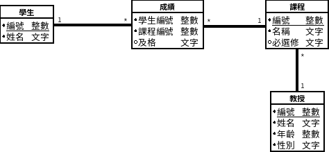

魔法學校選課資料

| 姓名 | 課程 | 必選修 | 及格 | 教師 |
| ----- | ----- | ----- | ----- | ----- |
| 妙麗 | 飛行學, 魔藥學, 符咒學 | 必選, 必選, 必選 | 及格, 及格, 及格 | 胡奇, 石內卜, 孚立維 |
| 湯姆 | 黑魔法防禦術, 古代神秘文字研究,  占卜學 | 必選, 選修, 選修 | 及格, 不及格, 不及格 | 鄧不利多, 戴華德, 勒梅 |

## 1NF：去除重複

第一正規化 (1NF) 是去除重複，所以：

1. 每個欄位只有一個值
2. 沒有任何兩筆以上資料是重複的

一格內不能重複放多筆資料，例如欄位課程放了不只一筆資料，如果要過濾出有科目不及格的學生及其科目，很難下 SQL 語法，所以一格只能放一筆資料。

| 姓名 | 課程 | 必選修 | 及格 | 教授 |
| ----- | ----- | ----- | ----- | ----- |
| 妙麗 | 飛行學 | 必修 | 及格 | 胡奇 | 
| 妙麗 | 魔藥學 | 必修 | 及格 | 石內卜 |
| 妙麗 | 符咒學 | 必修 | 及格 | 孚立維 |
| 湯姆 | 黑魔法防禦術 | 必選 | 及格 | 鄧不利多 |
| 湯姆 | 古代神秘文字研究 | 選修 | 不及格 | 戴華德 |
| 湯姆 | 占卜學 | 選修 | 不及格 | 勒梅 |

這樣要過濾出有科目不及格的學生及其科目，可以用以下的 SQL

``` sql
SELECT 姓名, 課程, 必選修, 教授
FROM 魔法學校選課資料
WHERE 及格 = '不及格'
```

如果魔法學校有相同姓名的學生在同一年級，例如有 2 個哈利，則會出現重複的資料，所以加上絕不會重複的編號，名爲主鍵，就能用 SQL 語法找出要的是哪一列資料

| 編號 | 姓名 | 課程 | 必選修 | 及格 | 教授 |
| :-----: | ----- | ----- | ----- | ----- | ----- |
| 1 | 哈利 | 飛行學 | 必修 | 及格 | 胡奇 | 
| 2 | 哈利 | 魔藥學 | 必修 | 及格 | 石內卜 |
| 3 | 哈利 | 符咒學 | 必修 | 及格 | 孚立維 |
| 4 | 哈利 | 飛行學 | 必修 | 及格 | 胡奇 | 
| 5 | 哈利 | 魔藥學 | 必修 | 及格 | 石內卜 |
| 6 | 哈利 | 符咒學 | 必修 | 及格 | 孚立維 |

選擇 6 號資料

``` sql
SELECT *
FROM 魔法學校選課資料
WHERE 編號 = 6
```

## 2NF：去除部分相依

第二正規化(2NF)：

1. 符合第一正規化
2. 所有非主鍵欄位都完全相依於主鍵，沒有部分相依

完全相依？部分相依？

- 相依性：某個欄位的值是跟著另一欄位的值改變，例如必選修與否是跟著課程決定。
- 完全相依：非主鍵欄位相依而且只相依於主鍵，例如姓名要相依於編號
- 部分相依：非主鍵欄位相依之間相依，而不相依於主鍵。例如必選修相依於課程，而不是主鍵編號

如果開學前要規劃新的課程，但是學生尚未入學，所以只是要新增課程。上述選課資料表沒有符合 2NF，要單獨新增課程實在很困難，會留下許多不必要的空格。

| 編號 | 姓名 | 課程 | 必選修 | 及格 | 教授 |
| :-----: | ----- | ----- | ----- | ----- | ----- |
| | | 飛行學 | 必修 | | 胡奇 | 

去除部分相依的方法是把部分相依欄位依照相依性另成一張表：

- 課程、必選修和教授獨立出課程資料表
- 編號和姓名獨立出學生資料表
- 及格相依於學生編號和課程，所以獨立出成績資料表

學生

| 編號 | 姓名 |
| :--: | ----- |
|  1 | 哈利 |
| 2 | 榮恩 |
| 3 | 妙麗 |
| 4 | 湯姆 |

課程

| 編號 | 名稱 | 必選修 | 教授 |
| :--: | ----- | ----- | ----- |
| 1 | 飛行學 | 必修 | 胡奇 |
| 2 | 魔藥學 | 必修 | 石內卜 |
| 3 | 符咒學 | 必修 | 孚立維 |

成績

| 學生編號 | 課程編號 | 及格 |
| :-------: | :------: | ----- |
|  1 | 1 | 及格 |
| 1 | 2 | 及格 |
| 2 | 1 | 及格 |

## 3NF：去除遞移相依

第三正規化(3NF)：

1. 符合第二正規化
2. 所有非主鍵欄位沒有遞移相依

遞移相依：非主鍵欄位之間有相依性。

我覺得遞移相依和部分相依根本是一樣的，所以 2NF 和 3NF 是一樣的？

如果在課程資料表新增教授的年齡和性別，則這兩個欄位和教授姓名完全相依，但是和課程編號部分相依，所以應該把教授獨立出一個資料表

教授

| 編號 | 姓名 | 年齡 | 性別 |
| :---: | ----- | ---- | :--: |
| 1 | 鄧不利多 | 250 | 男 |
| 2 | 石內卜 | 50 | 男 |
| 3 | 胡奇 | 55 | 女 |

## B-C NF：主鍵不相依於非主鍵
Boyce-Codd 正規化(B-C NF)：

1. 符合第三正規化
2. 主鍵的各個欄位不相依於非主鍵欄位

所以主鍵如果只有一個欄位，則只要符合第三正規化，就符合 B-C 正規化。只有複合主鍵需要考慮第二個條件。

成績資料表中，欄位學生編號沒有相依於及格，課程編號也沒有相依於及格，所以符合 B-C 正規化

成績

| 學生編號 | 課程編號 | 及格 |
| :-------: | :------: | ----- |
|  1 | 1 | 及格 |
| 1 | 2 | 及格 |
| 2 | 1 | 及格 |

## ER-Model

首先描述需求，從中找出名詞，決定彼此之間的關係。

今天哈利來到霍格華茲，認識了同學榮恩和妙麗，他們一起上一年級，基本上都是必修課，有飛行學、魔藥學和符咒學，教授分別是胡奇、石內卜和孚立維。他們三個人中妙麗最用功，成績最好，榮恩則是常常唸錯咒語，符咒學看來很難及格，哈利一下子就能騎著光輪2000到處飛來飛去，胡奇教授對他另眼相看。

需求描述中的名詞有同學、必修課、年級、教授和成績，接著決定彼此間的關係：

- 一個學生可以修多個課程，一個課程可以有多個學生修習，多對多關係需要拆分出樞紐資料表。欄位學生和課程決定出這個學生在這門課的成績，所以獨立出成績資料表
- 一個教授可以教多個課程，一個課程只能有一個教授，所以是一對多關係


